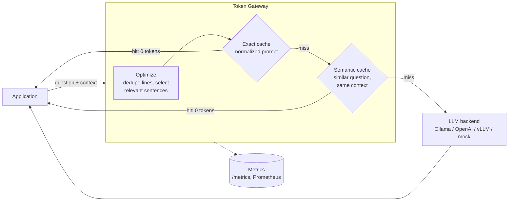

# LLM Token Optimization Gateway

[](https://github.com/vipati/llm-token-optimization-gateway/actions/workflows/ci.yml)


A gateway that sits between your application and any LLM and **cuts the prompt tokens you pay for**. It trims irrelevant context and serves repeated or reworded questions from cache. Every request reports what it saved and how much latency the gateway added.

On a replayed customer-support workload it sent **91.7% fewer prompt tokens** to the model. Every answer fact survived compression, the semantic cache made no wrong matches, and the gateway added **under 1 ms** of p95 latency.


## Why

RAG and support bots send the model the same long prompts over and over: a system preamble, repeated boilerplate, and whole documents when one paragraph is relevant. Users also ask the same questions in slightly different words. Both waste tokens, and tokens are cost and latency.

This gateway handles both problems in one place, without changes to the application or the model.

## How it works



1. **Optimize.** Remove duplicated lines and section headings, then rank context sentences by overlap with the question. Keep the best ones within a token budget, in their original order. A prompt is never made longer than the original.
2. **Exact cache.** An LRU cache with a TTL, keyed on the normalized optimized prompt and namespaced by model. Differences in whitespace, casing, or irrelevant context still map to the same entry.
3. **Semantic cache.** A reworded question ("How *can* I reset my password?") reuses a stored answer when its cosine similarity is above a threshold. Matches only count within the **same model and same context**, so a similar question about different documents never gets a stale answer.
4. **Backend.** Any OpenAI-compatible `/chat/completions` API: Ollama, vLLM, LM Studio, or OpenAI. The default is a deterministic in-process mock, so everything runs offline with no API keys.
5. **Metrics.** Every response carries tokens before and after, estimated cost saved, cache result, and gateway overhead separated from model latency. Totals and p50/p95 latency are available at `/metrics`, with a Prometheus endpoint at `/metrics/prometheus`.

## Results

`token-gateway benchmark` replays [a support workload](data/benchmark/support_kb.json) through the gateway: 3 knowledge-base contexts, 16 questions, paraphrases, and repeats (65 requests). Each question has a **gold fact**, which lets the benchmark check that compression kept the information needed to answer.

| Metric | Result |
| --- | --- |
| Requests replayed | 65 (16 unique questions) |
| Prompt tokens without gateway | 16,020 |
| Prompt tokens sent to model | 1,335 |
| **End-to-end token reduction** | **91.7%** |
| Reduction from compression alone | 71.8% |
| Context recall (answer fact kept) | 100% |
| Answer accuracy: direct vs gateway | 62% vs 68% |
| Exact cache hit rate | 49% |
| Semantic cache hit rate | 22% |
| Semantic hits matched to a different question | 0 |
| Gateway overhead p50 / p95 | 0.48 ms / 0.66 ms |

Measured with the `tiktoken/cl100k_base` tokenizer. CI reruns the benchmark on every push.

**How to read these numbers:**
- **Context recall** is the gateway's real quality guarantee. The fact that answers each question was still in the prompt after compression in all 16 cases.
- **Answer accuracy** measures the deterministic mock model, which picks the context sentence that best matches the question. It's a simple lexical model, so its absolute accuracy is low. What matters is that the gateway didn't reduce it. Accuracy actually went up, because removing distracting sentences helps. Run the benchmark against a real model for absolute numbers.
- **The workload is synthetic and repetitive by design**, to resemble support traffic. Cache hit rates depend on how often your users repeat questions, so treat them as an example, not a promise.

## Quickstart

Requires [uv](https://docs.astral.sh/uv/) and Python 3.12+.

```bash
uv sync
uv run pytest
uv run token-gateway benchmark
./scripts/run-demo.sh            # Windows: .\scripts\run-demo.ps1
```

Run the API:

```bash
uv run uvicorn token_gateway.api:app --reload
```

```bash
curl -s localhost:8000/complete -H "Content-Type: application/json" -d '{
  "question": "How long is the password reset link valid?",
  "context": "Users reset passwords from the login page. The reset link expires after 30 minutes. Invoices are sent monthly."
}'
```

### Use a real model

Point the gateway at any OpenAI-compatible endpoint. With [Ollama](https://ollama.com):

```bash
export TOKEN_GATEWAY_BACKEND=openai
export TOKEN_GATEWAY_BASE_URL=http://localhost:11434/v1
export TOKEN_GATEWAY_MODEL=llama3.2
uv run uvicorn token_gateway.api:app
```

For OpenAI, set `TOKEN_GATEWAY_BASE_URL=https://api.openai.com/v1` and `TOKEN_GATEWAY_API_KEY`.

### Docker

`docker compose up --build` runs the gateway and the bundled model service as **separate containers communicating over HTTP**. It's the same network boundary you'd have with a real model server.

## API

| Endpoint | Purpose |
| --- | --- |
| `POST /complete` | Optimize, check caches, call the model; returns answer, optimized prompt, and metrics |
| `POST /optimize` | Dry run: shows the optimized prompt and token savings without calling the model |
| `GET /metrics` | Totals, cache hit rates, tokens saved, p50/p95 overhead and model latency |
| `GET /metrics/prometheus` | The same metrics in Prometheus text format |
| `GET /health` | Status, active backend, model, and tokenizer |
| `GET /tokens?text=` | Token count for a string |

A backend failure returns `502` and is counted in `backend_errors`.

## Configuration

All settings are environment variables. See [.env.example](.env.example).

| Variable | Default | Notes |
| --- | --- | --- |
| `TOKEN_GATEWAY_BACKEND` | `mock` | `mock` or `openai` (any OpenAI-compatible API) |
| `TOKEN_GATEWAY_BASE_URL` | `http://localhost:11434/v1` | Backend base URL |
| `TOKEN_GATEWAY_MODEL` | `tiny-local-model` | Default model; requests can override it |
| `TOKEN_GATEWAY_TOKENIZER` | `regex` | `tiktoken` for BPE counts (`uv sync --extra tiktoken`) |
| `TOKEN_GATEWAY_MAX_CONTEXT_TOKENS` | `120` | Context budget after compression |
| `TOKEN_GATEWAY_CACHE_MAX_ENTRIES` | `10000` | LRU bound for each cache |
| `TOKEN_GATEWAY_CACHE_TTL_SECONDS` | `3600` | Entry lifetime |
| `TOKEN_GATEWAY_SEMANTIC_CACHE` | `true` | Turn semantic matching on or off |
| `TOKEN_GATEWAY_SEMANTIC_THRESHOLD` | `0.8` | Minimum cosine similarity for a semantic hit |

## Design decisions and tradeoffs

- **Cache after optimizing, not before.** Keying on the optimized prompt means requests that differ only in irrelevant context share a cache entry. The cost is running compression on every request, and the benchmark shows that takes under a millisecond.
- **Semantic matches are limited to the same context.** Sharing answers across contexts would raise the hit rate, but it risks serving an answer grounded in the wrong documents. I chose correctness, and the benchmark's false-match count measures it.
- **Question words and negations count for matching.** "*When* are invoices generated?" and "*Where* are invoices generated?" share almost every word but need different answers. So words like *when, where, how, can, not* are kept, not dropped as stop words. Tests cover this.
- **Lexical similarity, not embeddings.** It's deterministic and adds no dependency or model call on the hot path. The tradeoff is that it misses paraphrases with no shared words ("sign in" vs "log on"). An embedding model can be plugged in behind the same `SemanticCache` interface.
- **Extractive compression, not an LLM summarizer.** It's fast, cheap, and predictable, and it can't invent facts. The tradeoff is that it can drop a relevant sentence that uses different words from the question. Context recall in the benchmark tracks this.
- **Bounded memory and thread safety.** Both caches are LRU- and TTL-bounded, and the latency window for metrics is a fixed-size deque. Shared state is protected by locks because FastAPI runs sync endpoints in a thread pool.

## Limitations and next steps

- **Caches are in-process.** Running several gateway replicas would need a shared store such as Redis for the exact cache, plus a vector index for the semantic cache.
- **Sentence ranking is lexical.** Ranking by embedding similarity (or BM25 across chunks) would improve recall on reworded questions.
- **No streaming responses yet** (`stream: true`).
- **No per-tenant token budgets or rate limits yet**, which are natural additions for a gateway.

## Project layout

```text
src/token_gateway/   gateway pipeline, caches, compression, backends, metrics, API, CLI, benchmark
src/llmapi/          deterministic model service with an OpenAI-compatible endpoint
data/benchmark/      support workload with gold facts and paraphrases
tests/               unit, API, backend (real HTTP), and benchmark tests
```

## License

MIT
