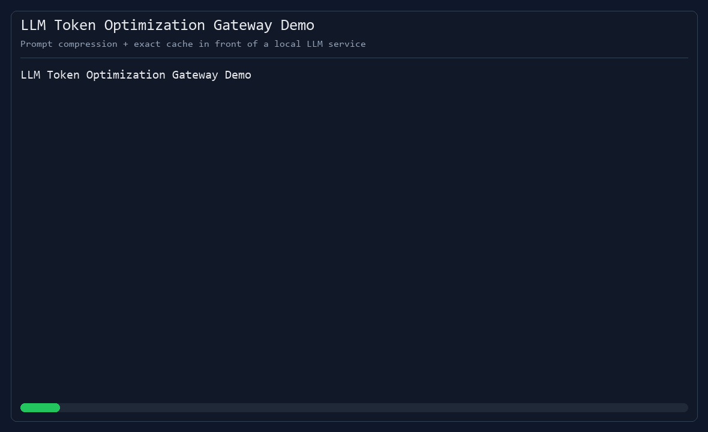

# LLM Token Optimization Gateway

An AI infrastructure project that reduces LLM token usage before requests reach a local model service.

## What It Does

The project places an optimization gateway between an application and a local LLM API:

```text
Application -> Token Gateway -> Local LLM API
```

The gateway:

- normalizes repeated requests
- checks exact cache hits
- selects important context sentences
- compresses prompts
- counts tokens before and after optimization
- estimates token and cost savings
- calls a local deterministic LLM service
- stores responses for future cache hits

## Local Service Boundary

The local model service lives under:

```text
src/llmapi/
```

The optimization layer lives under:

```text
src/token_gateway/
```

## Quickstart

```powershell
uv sync
uv run pytest
uv run ruff check .
uv run token-gateway count data/examples/support_prompt.txt
uv run token-gateway complete "How do I reset my password?" data/examples/support_prompt.txt
.\scripts\run-demo.ps1
uv run uvicorn token_gateway.api:app --reload
```

## Demo Recording

Use the repeatable demo script:

```powershell
powershell -ExecutionPolicy Bypass -File .\scripts\run-demo.ps1
```

Recording guidance is in [docs/demo-recording.md](docs/demo-recording.md).



## API

```text
GET /health
POST /optimize
POST /complete
GET /metrics
```

## Current Scope

This version uses a deterministic local model service so token optimization can be tested without external keys or hosted APIs.
